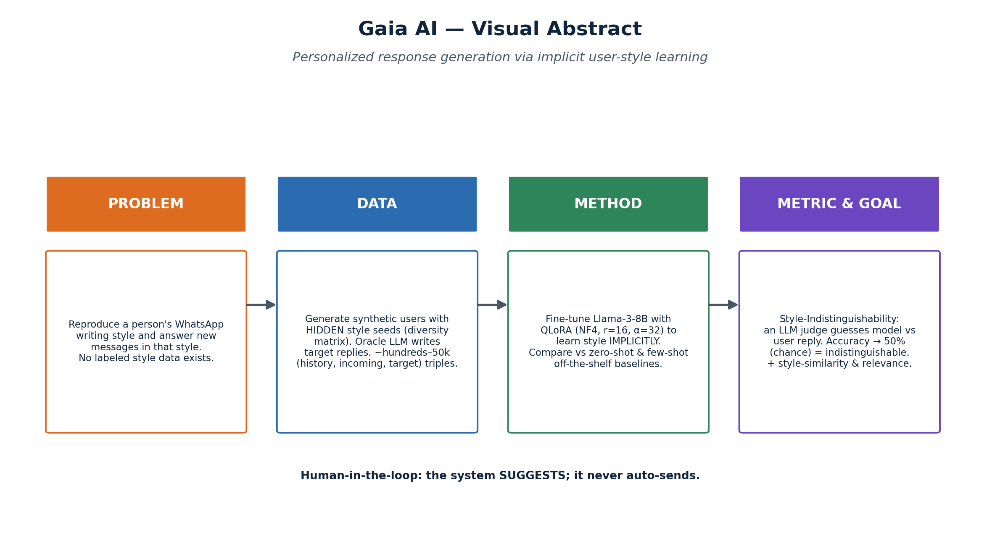
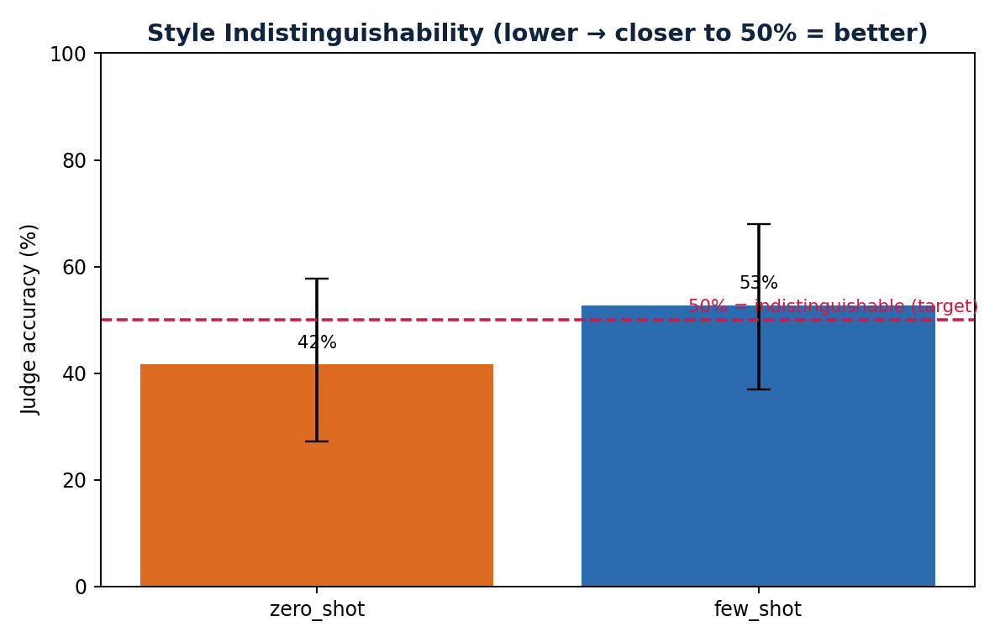

# Gaia AI

> **Personalized response generation via implicit user-style learning.**
> Gaia AI learns a user's WhatsApp writing style from their own chat history and
> **suggests** replies in that style — with the human always approving before sending.



This repository is the deliverable for the **LLM course (HIT)** project. It follows the
course recipe: define a **novel, data-free task → generate synthetic data → fine-tune a
model and compare it against off-the-shelf baselines → evaluate with a sound metric.**

---

## 1 · Project motivation
Communication-heavy people (educators, consultants, founders, support agents) get floods
of messages whose replies follow a consistent **personal style**. Replying manually is slow;
generic auto-replies sound nothing like the person. The problem is hard because a person's
style is **implicit** (length, punctuation, emoji, slang, rhythm, greetings) and **no public
labeled "style" dataset exists**. Gaia AI investigates whether an LLM can learn this implicit
style and reproduce it well enough to be **indistinguishable** from the user.

## 2 · Problem statement
**Formal task:** conditional text generation with *implicit* style conditioning.
- **Input:** a user's chat history `H = [m₁ … mₖ]` + a new incoming message `x`.
- **Output:** a reply `ŷ` that (a) addresses `x` and (b) preserves the user's implicit style.
- **Novelty:** style is learned *without labels*, and success is measured by
  **Style-Indistinguishability** (an LLM judge → 50% accuracy = chance), not a soft score.

## 3 · Visual abstract
See [`visuals/visual_abstract.png`](visuals/visual_abstract.png) (above) and the
[architecture](visuals/architecture.png) and [pipeline](visuals/pipeline.png) diagrams.

## 4 · Datasets used or collected
- **Synthetic (primary).** `__N_PERSONAS__` synthetic users, each with a **hidden** style seed
  sampled from a 10-axis diversity matrix; an oracle LLM (which *does* see the seed) writes the
  target replies → `__N_PAIRS__` `(history, incoming, target)` triples. Committed under
  [`ml/data/synthetic/`](ml/data/synthetic/); see [`data/README.md`](data/README.md).
- **Real (optional, evaluation only).** Opt-in, anonymized, AES-256-GCM encrypted, **gitignored**.
- **Splits** are **per-user** (no user in both train and test) → tests generalization to unseen people.

## 5 · Data augmentation & generation methods
Self-Instruct-style synthetic generation in [`ml/synthetic/`](ml/synthetic/):
1. [`_diversity.py`](ml/synthetic/_diversity.py) samples an orthogonal **style seed** per user
   (language he/en × length × emoji × slang × formality × rhythm × punctuation × greeting × occupation × age).
2. [`generate_personas.py`](ml/synthetic/generate_personas.py) → a persona that *adheres to but never reveals* the seed.
3. [`generate_histories.py`](ml/synthetic/generate_histories.py) → ~20–50 style-reference messages per user.
4. [`generate_pairs.py`](ml/synthetic/generate_pairs.py) → incoming messages + **oracle** target replies.

Robustness: bracket-matching JSON extraction + per-item skip-on-error, and rate-limit-aware
backoff so generation is reproducible on free API tiers.

## 6 · Input / Output examples
__IO_EXAMPLE__

## 7 · Models and pipelines used
| Step | Model / tool |
|---|---|
| Synthetic generation & LLM judge | Claude / GPT-4o / Groq Llama-3.x (via [`ml/_llm.py`](ml/_llm.py)) |
| **Fine-tuned model** | `meta-llama/Meta-Llama-3-8B-Instruct` + **QLoRA** |
| Off-the-shelf baselines | zero-shot & few-shot prompting (same base LLMs) |
| Oracle (upper bound) | LLM that saw the hidden style seed |
| Style-similarity embedder | `intfloat/multilingual-e5-large` (he+en) |

Pipeline: `synthetic → dataset/build_jsonl → train/train_qlora → eval/run_all`
(see [`visuals/pipeline.png`](visuals/pipeline.png) and [`docs/architecture.md`](docs/architecture.md)).

## 8 · Training process and parameters
QLoRA fine-tuning ([`ml/train/train_qlora.py`](ml/train/train_qlora.py), [`config.yaml`](ml/train/config.yaml)):
- Base: Llama-3-8B-Instruct, **4-bit NF4** quantization, double-quant, bf16 compute.
- LoRA: **r=16, α=32, dropout=0.05**, target modules `q/k/v/o_proj`.
- 3 epochs, lr 2e-4 (cosine, warmup 0.03), effective batch 16 (4 × grad-accum 4), max-seq 2048.
- Runs on a cloud GPU: `modal run ml/train/modal_app.py::main` or `bash ml/train/runpod_command.sh`.

## 9 · Metrics
1. **Style-Indistinguishability (headline).** An LLM judge sees history + incoming + two replies
   (oracle vs. ours, randomized) and guesses the user's. **Target ≈ 50%** (chance) = indistinguishable.
   Reported with 95% Wilson CI and an order-bias check; judge model separated from the generator.
2. **Style similarity.** Cosine similarity in a **multilingual** embedding space vs. the user's history.
3. **Relevance.** LLM 1–5: does the reply actually address the message? (guards against style-without-content).

Full methodology: [`docs/evaluation.md`](docs/evaluation.md).

## 10 · Results
Off-the-shelf baselines were evaluated **for real** (Groq) on the held-out per-user test split.
The **fine-tuned** arm requires a GPU run (see §8) — it is the core comparison and is marked accordingly.

__RESULTS_TABLE__



Reproduce: `cd ml && python -m eval.run_all --models zero_shot,few_shot` →
`ml/results/eval_report.{json,md,csv}`, then `python -m eval.plots` for the figures.
Raw report: [`ml/results/eval_report.md`](ml/results/eval_report.md). EDA: [`results/eda_stats.json`](results/eda_stats.json).

## 11 · Repository structure
```
gaia-ai/
├── slides/        proposal · interim · final  (PPTX + PDF) + build_slides.py
├── data/          data guide + curated sample (full synthetic data in ml/data/synthetic/)
├── results/       eda_stats.json (eval report in ml/results/)
├── visuals/       architecture · pipeline · visual_abstract · eda/ · results/  (+ make_diagrams.py)
├── docs/          architecture · api · evaluation · prompts · proposal · related_work · deployment
├── ml/            synthetic/ · dataset/ · train/ · inference/ · eval/ · eda/ · notebooks/
├── backend/       FastAPI + Celery (product plane)
├── frontend/      Next.js 14 dashboard
├── whatsapp-bridge/  Node whatsapp-web.js bridge
└── infra/         Postgres init, Qdrant config
```

## 12 · Team Members
- **Adir** — sole author (project design, data generation, fine-tuning pipeline, evaluation, write-up).

---

## Quickstart (research pipeline)
```bash
python3.11 -m venv .venv && source .venv/bin/activate
pip install -e ml                       # or: pip install anthropic openai tenacity python-dotenv numpy pandas sentence-transformers matplotlib python-pptx nbformat nbconvert jupyter
cp .env.example .env                     # set LLM_PROVIDER + an API key (Groq/OpenAI/Anthropic)

cd ml
python -m synthetic.generate_personas  --n 30
python -m synthetic.generate_histories --n-messages 20
python -m synthetic.generate_pairs     --pairs-per-user 8
python -m dataset.build_jsonl
python -m eda.run_eda                   # EDA figures + ../results/eda_stats.json
python -m eval.run_all --models zero_shot,few_shot   # baselines (no GPU)
python -m eval.plots                    # result figures
# then, on a GPU: train QLoRA and re-run eval with GAIA_LORA_ADAPTER set for the fine_tuned column
```
Build the reporting artifacts: `make visuals && make slides && make notebooks` (or the scripts directly).

The full product stack (FastAPI + Next.js + WhatsApp bridge + Postgres/Mongo/Qdrant/Redis) runs via
`make up`; it **never auto-sends** — it only suggests, and the human approves.

## Privacy & Consent
Real WhatsApp data is used **only** with explicit per-user opt-in, encrypted at rest (AES-256-GCM),
and is **gitignored**. The primary dataset is **synthetic**; real data (if any) is evaluation-only.

## License
Educational / research use. WhatsApp Web automation is unofficial — review WhatsApp's ToS before any production use.
